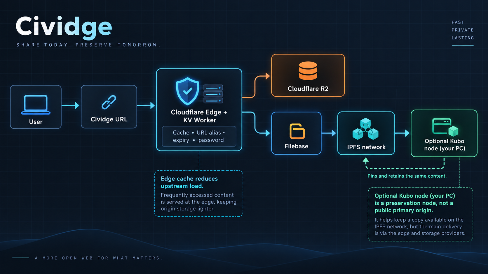

# Civitai Bridge (Cividge)

**A data-sovereign uploader for ComfyUI and Civitai users.** Cividge is for creators who want to keep control of their media, URLs, and storage credentials while aiming to keep an origin alive for as long as practical with free-tier infrastructure.

It converts media locally in the browser, uploads directly to your own Cloudflare R2 or Filebase bucket, and places a small Cloudflare edge control plane in front of the object. There is no central Cividge upload server.



## Why Cividge

AI creators need more than a temporary file host: they need stable links for Civitai posts, image boards, prompts, workflows, and personal archives. Cividge separates the parts that should remain yours:

- **Browser:** local conversion and direct S3 API upload.
- **Storage:** a Cloudflare R2 bucket or Filebase IPFS bucket in your own account.
- **Delivery:** readable URLs in the form `delivery-domain/file-name`.
- **Control plane:** Workers KV records aliases, expiry, password gates, and delivery metadata.
- **Preservation:** Filebase/IPFS and an optional Kubo node can keep content reachable after Filebase capacity is released.

This is not a promise of permanent storage. It is a practical, user-controlled design that avoids dependence on one application server and makes the storage lifecycle explicit.

The lifecycle properties that Cividge must preserve are defined in
[SPEC.md](SPEC.md). It is the contract for links, shared CID cleanup, expiry,
password gates, retries, and Kubo preservation.

## Features

- Browser-side WebP, JPEG, and JPEG XL conversion, plus metadata and workflow inspection.
- Direct S3-compatible upload to Cloudflare R2 or Filebase IPFS.
- Per-storage delivery domains, aliases, rename-safe links, and `delivery-domain/file-name` URLs.
- Cloudflare edge delivery with KV-backed resolution, expiry, password gates, Open Graph responses, byte ranges, and cache control.
- Local Filebase CID detection: duplicate bytes become an alias instead of another upload.
- Separate FIFO capacity controls for R2 and Filebase.
- Optional Kubo pin preservation before Filebase releases an object.
- Video Open Graph thumbnails that follow aliases and are deleted with their parent origin object.
- Optional Windows **Send To** integration and external upload API.
- `X-Image-Width` and `X-Image-Height` response headers for newly uploaded images.

## Architecture

| Layer | Responsibility |
| --- | --- |
| Cividge Pages | Browser UI, local conversion, direct R2 / Filebase upload |
| KV delivery and management Worker | Registry for URLs, object keys/CIDs, aliases, expiry, passwords, and delivery |
| Cloudflare Edge | Caching, Open Graph responses, and traffic absorption |
| Cloudflare R2 | Conventional object storage |
| Filebase / IPFS | CID-based IPFS storage and retrieval |
| Kubo (optional) | A self-managed node that pins CIDs before Filebase capacity release |

Kubo is a preservation layer. Its RPC endpoint is used for pin operations; configuring Kubo alone does not make it the public primary origin for every request. Keep important media in another backup as well.

## Prerequisites

- Node.js 18 or later
- A Cloudflare account
- Wrangler (`npx wrangler` is sufficient)
- A Cloudflare R2 bucket and/or a Filebase IPFS bucket

## Setup overview

The frontend repository (`cividge`) and the delivery/registry Worker repository (`cividge-kv-worker`) work together.

1. Create one Cloudflare Workers KV namespace.
2. Deploy `cividge-kv-worker` with that namespace and a private admin token.
3. Deploy `cividge` to Cloudflare Pages using the same namespace binding.
4. In Cividge, connect the KV Worker first, then connect R2 and/or Filebase.
5. Register separate delivery domains for R2 and Filebase.
6. Configure R2 CORS when using browser-to-R2 uploads.

> Do not register the same delivery domain for both R2 and Filebase. URLs are `delivery-domain/file-name`; sharing a domain makes same-name objects ambiguous.

### 🤖 For AI Coding Agents (Codex, Claude, etc.)

This repository includes official agent skills in [`.codex/skills/`](.codex/skills/) to automate safe builds, deployments, and public relay creation without breaking existing routes:

- **`cividge-deploy`**: Safely pulls latest code, enforces `npm run build`, and deploys to Cloudflare Pages or Workers with automated curl health verification.
- **`cloudflare-pages-relay`**: Deploys function-free, disposable `pages.dev` 307 relays and registers them into the multi-relay worker without exposing origin domains.

## 1. Deploy the KV delivery and management Worker

```bash
git clone https://github.com/OKPN/cividge-kv-worker.git
cd cividge-kv-worker
npx wrangler login
```

Create a Workers KV namespace in Cloudflare, then bind it as `CIVIDGE_KV` (and `IPFS_KV` for backward compatibility) in `wrangler.toml`:

```toml
[[kv_namespaces]]
binding = "CIVIDGE_KV"
id = "<your-kv-namespace-id>"

# Backward compatibility alias
[[kv_namespaces]]
binding = "IPFS_KV"
id = "<your-kv-namespace-id>"
```

Set a long, random admin token and deploy. Never commit this token.

```bash
npx wrangler secret put ADMIN_API_TOKEN
npx wrangler deploy
```

Save the resulting `https://<worker>.<account>.workers.dev` URL. It is the Cividge KV delivery and management Worker URL.

### Optional: external upload API

For Windows **Send To** or curl uploads, use a separate upload-only token:

```bash
npx wrangler secret put UPLOAD_TOKEN
```

If the Worker itself uploads to Filebase, also provide a bucket-scoped Filebase IPFS RPC API key:

```bash
npx wrangler secret put FILEBASE_IPFS_API_KEY
```

Do not reuse `ADMIN_API_TOKEN` in batch files or external upload clients.

## 2. Deploy Cividge to Cloudflare Pages

```bash
git clone https://github.com/OKPN/cividge.git
cd cividge
npm install
npx wrangler login
```

Bind the **same** Workers KV namespace in this repository's `wrangler.toml`:

```toml
[[kv_namespaces]]
binding = "CIVIDGE_KV"
id = "<your-kv-namespace-id>"

# Backward compatibility alias
[[kv_namespaces]]
binding = "IPFS_KV"
id = "<your-kv-namespace-id>"
```

Build and deploy:

```bash
npm run build
npx wrangler pages deploy dist --project-name=my-cividge
```

The resulting `https://my-cividge.pages.dev` URL is your frontend URL. Use it as an allowed origin in R2 CORS; it is not necessarily a delivery domain.

For a local production-like check:

```bash
npm run preview
```

## 3. Connect services in Cividge

Open your Pages deployment and configure services in this order:

1. **KV Delivery & Management Worker** — enter its URL and `ADMIN_API_TOKEN`, then connect.
2. **Cloudflare R2** and/or **Filebase (IPFS)** — enter each storage provider's credentials and connect.
3. Register one or more dedicated delivery domains for each provider.

The Worker URL works as the first delivery domain. You can later add a dedicated Pages URL or custom domain.

## Cloudflare R2

Create an R2 bucket and an S3 API token, then enter:

- Cloudflare Account ID
- R2 bucket name
- Access Key ID
- Secret Access Key

### R2 CORS is required for browser uploads

Cividge calls R2's S3 API directly from the browser. In Cloudflare Dashboard, open **R2 → your bucket → Settings → CORS Policy → Edit**, then paste the policy generated by Cividge's **Copy CORS policy** button.

Allow the URL where the frontend is opened, such as `https://my-cividge.pages.dev`; do not use the media delivery domain as the CORS origin.

```json
[
  {
    "AllowedOrigins": [
      "https://my-cividge.pages.dev",
      "http://127.0.0.1:5173",
      "http://localhost:5173"
    ],
    "AllowedMethods": ["GET", "HEAD", "PUT", "POST", "DELETE"],
    "AllowedHeaders": ["*"],
    "ExposeHeaders": ["ETag", "Content-Length", "Content-Type"],
    "MaxAgeSeconds": 3600
  }
]
```

## Filebase / IPFS

Create an IPFS bucket and S3 access keys in Filebase, then enter:

- Filebase bucket name
- Filebase Access Key
- Filebase Secret Key
- A Filebase-only delivery domain

After connecting, run **Configure CORS** once so the bucket permits the required browser-side CID lookup.

When Cividge sees a Filebase object with the same CID, it does not upload the bytes again. It creates a new alias URL pointing to the existing object instead.

### Create a Filebase delivery URL

Use a Pages project separate from R2. From this repository:

```bash
npx wrangler login
npm run build
npx wrangler pages deploy dist --project-name=my-filebase-delivery
```

Add the resulting `https://my-filebase-delivery.pages.dev` through the Filebase delivery-domain **＋** button. A custom domain can be used instead when configured on Cloudflare.

### Stable public `pages.dev` URLs for Filebase

If you want a board-facing `pages.dev/file-name.ext` URL while keeping a
separate Filebase compatibility Worker/domain behind it, deploy the
function-free template in [`compatibility-layer/filebase`](compatibility-layer/filebase/).
Add the resulting public Pages URL to the **Filebase delivery-domain** list and
select it. There is no per-upload switch: the selected delivery domain is always
the public URL Cividge copies and posts.

The relay has no Functions, KV access, or storage credentials. It only forwards
the path to the configured compatibility Worker/domain. Add a URL Rewrite Rule
on that backend domain to remove query strings; the Filebase template uses an
internal `/r/` path marker so the Worker still identifies the public entry after that
rewrite.

For R2, use the analogous [`compatibility-layer/r2`](compatibility-layer/r2/)
template. Point it at the R2 custom domain or `r2.dev` origin, then add and
select its public Pages URL in the **R2 delivery-domain** list.

## Optional: use Kubo as a preservation node

Install and start Kubo, then normally set its RPC URL to `http://127.0.0.1:5001`. Enable automatic Kubo pinning only after the connection test succeeds.

- When automatic Kubo pinning is enabled but Kubo is unavailable, Filebase FIFO safely pauses rather than releasing objects without preservation.
- Check Kubo's storage path and available space. Keep important data in another backup or pinning service.
- Do not expose the Kubo API through `0.0.0.0:5001`, router port forwarding, or a public reverse proxy.
- For remote use, prefer a Tailnet-only HTTPS endpoint such as Tailscale Serve instead of opening ports to the internet.

## Delivery, expiry, and deletion behavior

- Public links use `delivery-domain/file-name`, not CID URLs.
- Video `.thumb.webp` objects are generated for Open Graph cards, hidden from the main list, and removed only when their parent video origin is removed.
- Video thumbnail references follow aliases and renamed links.
- Expiry does not use a Cron sweep. On the first request after expiry, Cividge turns that link into a 404. A CID remains pinned while another alias to the same CID remains active.
- Filebase FIFO releases the Filebase pin while preserving the URL for IPFS delivery. R2 FIFO deletes the old R2 object and its associated links.
- For newly uploaded images, delivery responses include `X-Image-Width` and `X-Image-Height` so clients can choose whether to preload a direct image.

## Security model and limits

- R2/Filebase S3 credentials are stored in the browser's `localStorage`. Use only a device and a Pages URL you trust.
- `ADMIN_API_TOKEN` can modify the registry. Never share a Worker or token intended for your private registry.
- Password protection protects Cividge delivery URLs. It does **not** make a known IPFS CID secret from an IPFS gateway. Strong confidentiality requires client-side encryption, which is not currently part of Cividge.
- Keep `UPLOAD_TOKEN` separate from the admin token and do not distribute upload batch files casually.
- This project improves resilience; it is not a substitute for backups or a promise of permanent availability.

## Development

```bash
npm install
npm run build
npm run preview
```

## Documentation and Guides

- [Storage Selection & Operations Guide](docs/STORAGE_SELECTION_GUIDE.md) — R2 vs Filebase vs Kubo selection criteria, gotchas (Egress, credit card, bandwidth limits), and workflow recommendations.
- [Security & Cache Runbook](docs/SECURITY_AND_CACHE_RUNBOOK.md) — Edge defense SOP against cache buster DoS and zero-trust configuration.
- [Free R2 + Pages CDN Guide](docs/FREE_R2_PAGES_CDN_GUIDE.md) — Zero-egress setup combining Cloudflare R2 and Pages.
- [System Invariants (INVARIANTS.md)](INVARIANTS.md) — Non-negotiable system rules and design constraints.
- [Specification (SPEC.md)](SPEC.md) — Core lifecycle contracts.

## Related repository

- [cividge-kv-worker](https://github.com/OKPN/cividge-kv-worker) — KV registry, delivery, and cache management Worker

## License

MIT License © 2026 OKPN

